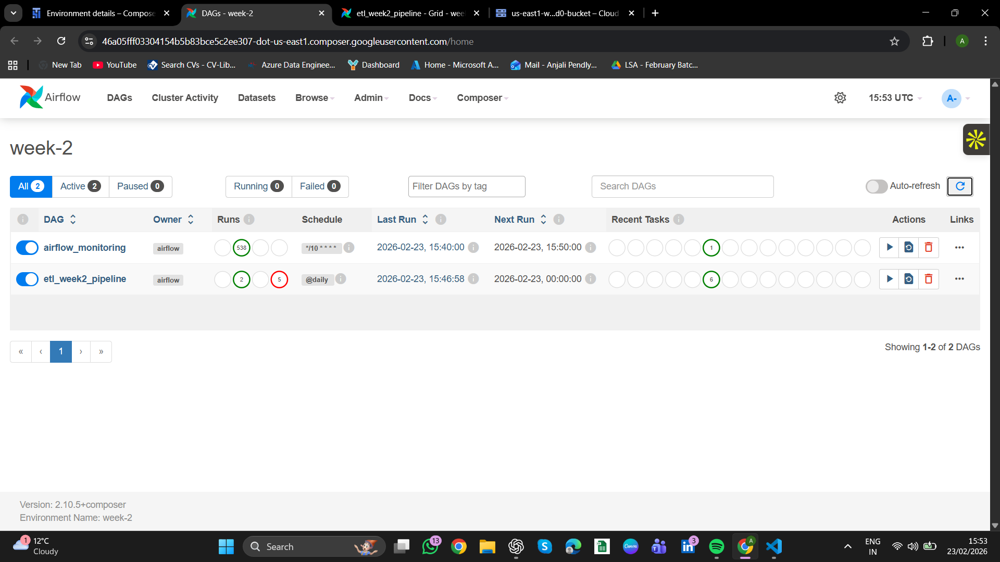

# Week 2 — ETL Orchestration using Airflow (GCP Composer)

## 📌 Overview

This project demonstrates an ETL pipeline orchestrated using Apache Airflow in Google Cloud Composer. The pipeline processes clickstream, transaction, and currency data, performs transformation and validation, and loads the data to Google Cloud Storage.

---

## 🧠 Architecture

Source Data → Ingestion → Transformation → Validation → Load to GCS → Metadata Logging

---

## ⚙️ DAG Workflow

The DAG consists of the following tasks:

1. ingest_clickstream
2. ingest_transactions
3. ingest_currency
4. transform_data
5. validate_data
6. load_to_gcs

Each task is implemented using PythonOperator.

---

## ✅ Data Validation

Validation is performed before loading data to ensure quality:

* Null value checks
* Positive transaction amounts
* Valid currency codes

If validation fails, the pipeline stops and logs the error.

---

## 📊 Metadata Tracking

Each task logs metadata including:

* Stage name
* Number of rows processed
* Status (success/failure)
* Timestamp

This helps monitor pipeline execution.

---

## 🚨 Monitoring & Alerts

* Email alerts are configured for task failures
* Logs are captured using Airflow logging

---

## 🛠 Technologies Used

* Apache Airflow (Cloud Composer)
* Python
* Google Cloud Storage

---

## 📸 Screenshots
## 📸 Screenshots

### DAG Graph

### DAG Runs

### Task Logs

---

## 💡 Assumptions

* Data is processed daily
* Input data is available in the required format
* Validation rules are applied before loading

---

## 🚀 Conclusion

This project demonstrates how to orchestrate ETL pipelines using Airflow, implement validation checks, track metadata, and monitor pipeline execution.
