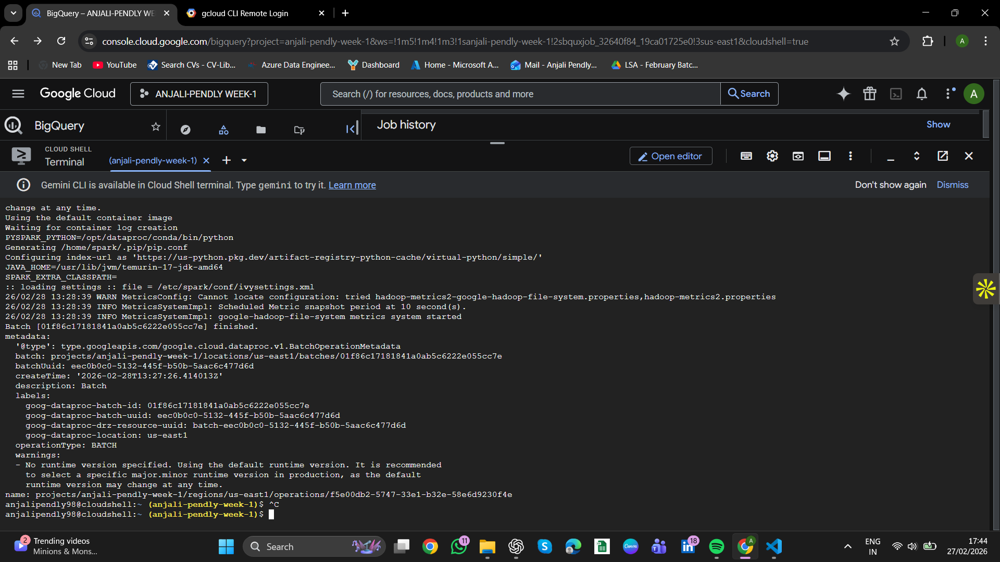
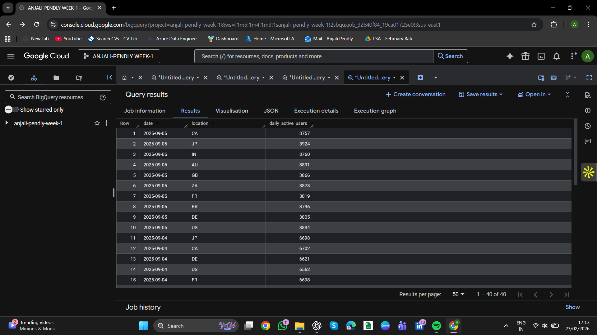

# Week 3 — Big Data Processing with Spark & BigQuery

## 📌 Overview

This project demonstrates large-scale data processing using Apache Spark on Google Cloud Dataproc and loading results into BigQuery for analytics.

---

## ⚙️ Spark Processing

### Clickstream Processing

* Parsed timestamps using PySpark
* Removed invalid records
* Deduplicated data
* Partitioned by `click_date`
* Stored output as Parquet in GCS

### Transactions Processing

* Joined transactions with currency rates
* Calculated `amount_usd`
* Partitioned by `txn_date`
* Stored output as Parquet in GCS

---

## 📦 Data Storage

Data is stored in Google Cloud Storage:

* `week3/output/clickstream_parquet/`
* `week3/output/transactions_parquet/`
* `week3/errors/`

Parquet format is used for efficient storage and querying.

---

## 🧠 BigQuery Data Warehouse

Datasets created:

* `raw_spark_outputs`

Tables:

* `clickstream`
* `transactions`
* `clickstream_errors`

Features:

* Partitioned tables using event date
* Optimized for query performance

---

## 🚨 Error Handling

* Invalid records (missing timestamps) are separated
* Stored in GCS error path
* Error tables created in BigQuery

---

## 📊 Analytical Queries

### 1. Daily Active Users

```sql
SELECT DATE(click_time) AS date, COUNT(*) AS users
FROM `anjali-pendly-week-1.raw_spark_outputs.clickstream`
GROUP BY date;
```

### 2. Location-wise Analysis

```sql
SELECT location, COUNT(*) AS total_events
FROM `anjali-pendly-week-1.raw_spark_outputs.clickstream`
GROUP BY location;
```

### 3. Last 30 Days Activity

```sql
SELECT DATE(click_time) AS date, COUNT(*) AS total_events
FROM `anjali-pendly-week-1.raw_spark_outputs.clickstream`
WHERE DATE(click_time) >= DATE_SUB(CURRENT_DATE(), INTERVAL 30 DAY)
GROUP BY date;
```

---

## 📸 Screenshots






---

## 💡 Key Learnings

* Distributed data processing using Spark
* Partitioning and Parquet storage
* BigQuery data warehouse design
* Query optimization and cost reduction
* Error handling in pipelines

---

## 🚀 Conclusion

Built an end-to-end big data pipeline from ingestion to analytics using GCP tools.
